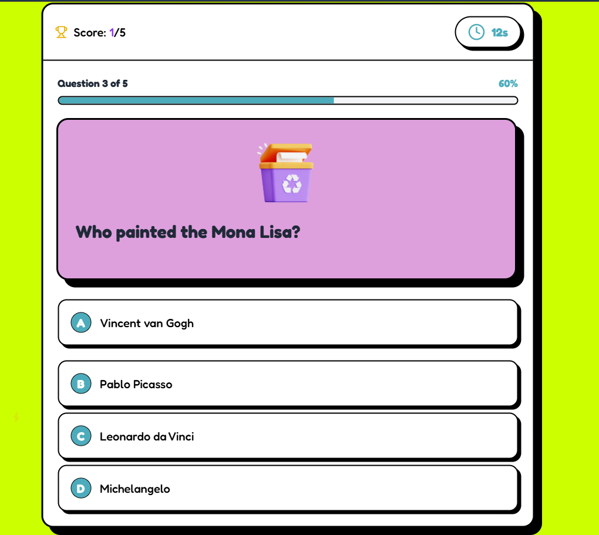
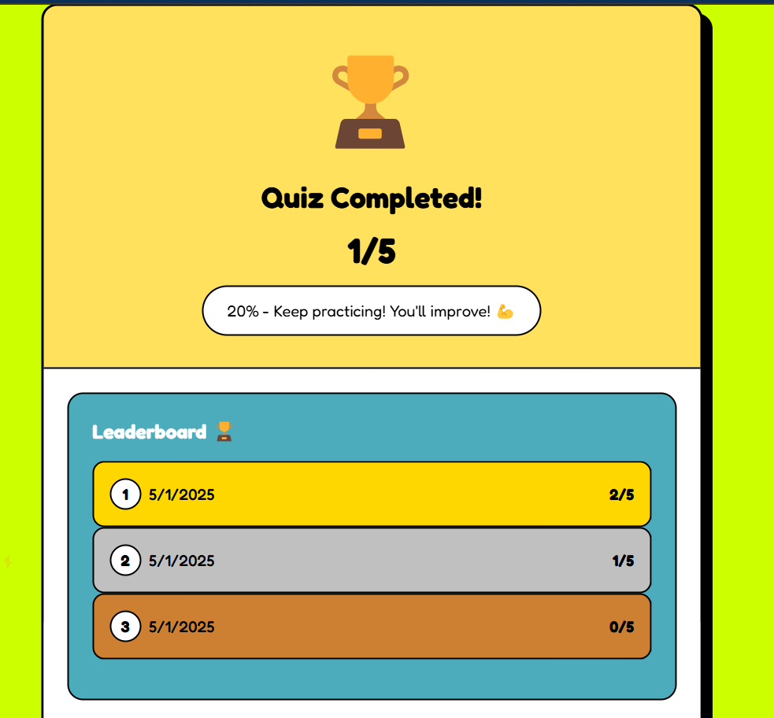

# Quizzzifyy - Interactive Quiz Application

Welcome to **Quizzzifyy!** 🌟  
Quizzzifyy is a dynamic single-page web application designed to deliver an engaging and interactive quiz experience. Perfect for testing knowledge or just having fun, it offers multiple-choice questions, real-time feedback, and score tracking—all wrapped in a user-friendly interface.

## 🖼️ Visual Overview

  
  

🌐 **Explore it live at:** [https://quizzzifyy.netlify.app/](https://quizzzifyy.netlify.app/) and dive into the quiz adventure!

---

## ✨ Key Features

- **Engaging Quiz Content**: Questions are stored as an array of objects, each with question text, multiple-choice options, and the correct answer.
- **Intuitive Interface**: Displays one question at a time with clickable answer options for a seamless experience.
- **Answer Submission**: Users select an answer and proceed with a "Next" button.
- **Progress Tracking**: Clearly shows the current question and total questions to keep users oriented.
- **Instant Feedback**: Provides immediate validation after each answer submission.
- **Score Management**: Tracks correct answers and calculates a final score.
- **Quiz Completion**: Presents a final score and performance summary with an option to restart.
- **Responsive Design**: A clean, modern, and mobile-friendly UI ensures accessibility across devices.

---

## 🖼️ Visual Overview

- **Quiz Question Interface**: Showcases a question with multiple-choice options and a progress indicator.
- **Answer Feedback**: Delivers instant feedback to guide users after each submission.
- **Final Score Display**: Highlights the user’s final score with an option to restart the quiz.

---

## 🛠️ Technologies

- **Frontend Framework**: React.
- **Styling**: Tailwind CSS.
- **Deployment**: Netlify.
